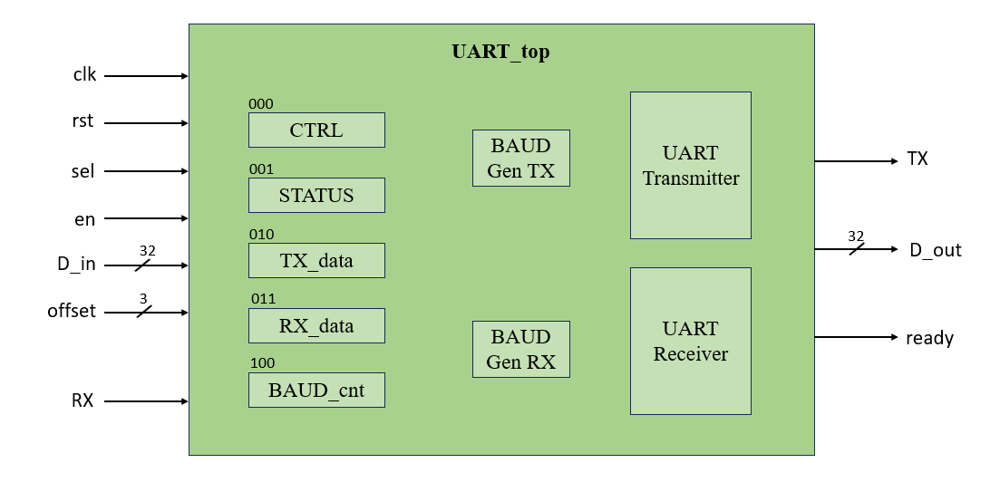
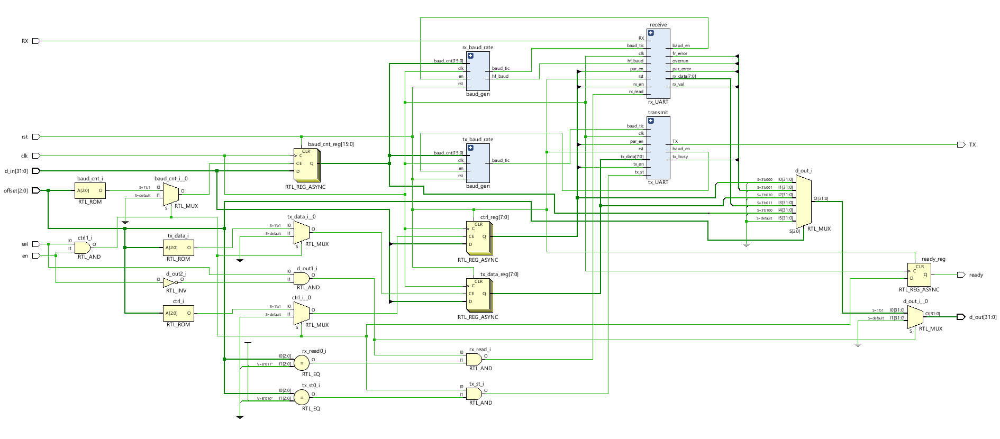
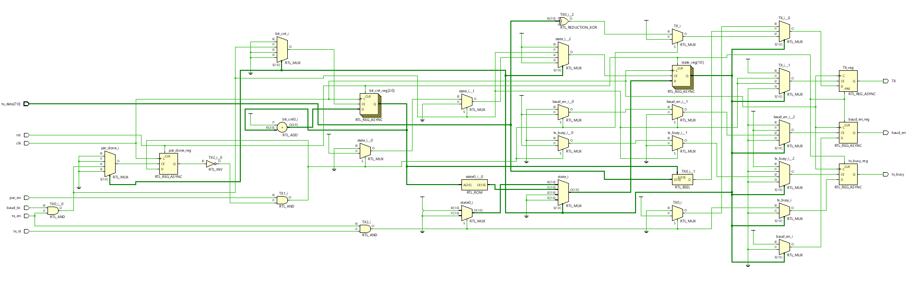
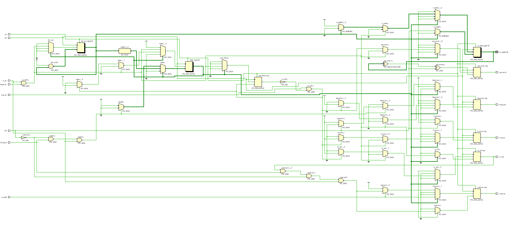
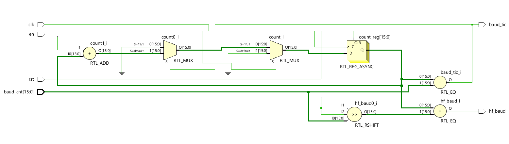
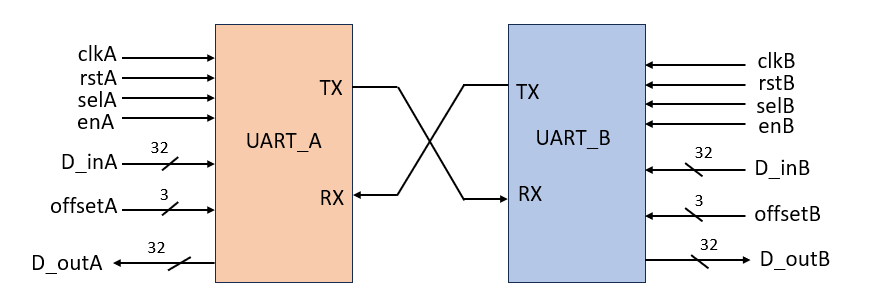
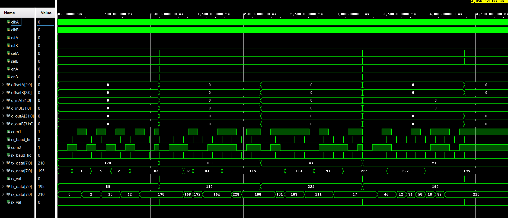
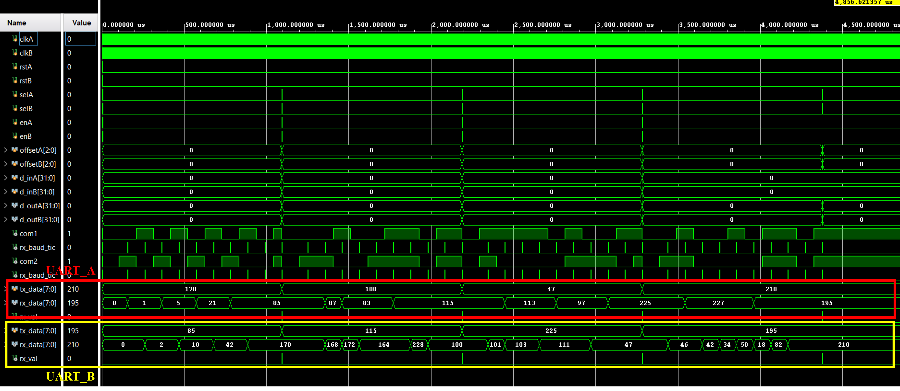

# Full-Duplex UART Peripheral - Verilog RTL

This repository contains a fully synthesizable UART (Universal Asynchronous Receiver Transmitter) design
implemented in Verilog HDL. The design consists of independent transmitter (TX),
receiver (RX), and baud rate generator modules integrated through a top-level UART module. 
The UART follows the standard serial communication protocol with configurable baud rates. 
The design has been verified using RTL simulation with UART full duplex testing, including successful back-to-back byte transfers.

---

## Features

- Full duplex TX and RX operation
- Optional even parity (configurable per transfer)
- Framing error and overrun detection on RX
- Center sampling RX — half baud tick aligns sample to bit center for noise immunity
- Separate baud generators for TX and RX, each independently gated
- Register-mapped control interface (`CTRL`, `STATUS`, `TXDATA`, `RXDATA`, `BAUD_CNT`)
- FSM based TX and RX datapaths (3-state: IDLE → TRANSFER/RECEIVE → DONE)
- Verified with two UART instances at 100 MHz and 50 MHz clocks, both running ~9600 baud

---

## Block Diagram



---

## Module Reference

### [UART_top](RTL%20Files/UART_top.v)

UART_top is the integration layer that ties the TX, RX, and dual baud generator instances into a single peripheral. 
It exposes a register-mapped interface via sel, en, and a 3-bit offset, covering five registers - CTRL, STATUS, TXDATA, RXDATA, and BAUD_CNT. 
Two independent baud_gen instances (one each for TX and RX) are gated separately by their FSMs but share the same baud_cnt value. 
Writing to TXDATA auto-generates the tx_st strobe to trigger transmission; reading RXDATA auto-asserts rx_read 
to clear the valid flag - keeping the interface minimal with no extra trigger writes needed.

| Port | Dir | Width | Description |
|------|-----|-------|-------------|
| `clk` | I | 1 | System clock |
| `rst` | I | 1 | Active-high synchronous reset |
| `sel` | I | 1 | Peripheral select |
| `en` | I | 1 | Write enable (1=write, 0=read) |
| `offset` | I | 3 | Register address (see register map) |
| `d_in` | I | 32 | Write data |
| `d_out` | O | 32 | Read data |
| `ready` | O | 1 | Write acknowledge (1 cycle pulse) |
| `TX` | O | 1 | Serial transmit line |
| `RX` | I | 1 | Serial receive line |


#### RTL Schematic



---

### [UART Transmitter](RTL%20Files/tx_UART.v)

tx_UART is a 3-state FSM that serializes an 8-bit byte LSB-first, 
preceded by a start bit and followed by an optional even parity bit and stop bit. 
It stays in IDLE until both tx_en and tx_st are asserted, at which point it pulls TX low (start bit) and enables the baud generator. 
Data bits are shifted out on each baud_tic, and once all 8 bits are sent, it moves to DONE to handle the parity/stop bit before returning to IDLE and deasserting tx_busy.

**States:** `IDLE → TRANSFER → DONE`

| Port | Dir | Description |
|------|-----|-------------|
| `clk`, `rst` | I | Clock, active-high reset |
| `tx_en` | I | TX enable (from `ctrl[0]`) |
| `par_en` | I | Parity enable (from `ctrl[2]`) |
| `baud_tic` | I | Baud tick from baud generator |
| `tx_data[7:0]` | I | Byte to transmit |
| `tx_st` | I | Transmit strobe (write to TXDATA register) |
| `TX` | O | Serial output line |
| `tx_busy` | O | High while frame in progress |
| `baud_en` | O | Gates the TX baud generator |

#### RTL Schematic



---

### [UART Receiver](RTL%20Files/rx_UART.v)

rx_UART is a 3-state FSM (IDLE → RECEIVE → DONE) that deserializes incoming data with center-sampling for noise immunity. 
In IDLE, it watches for a falling edge on RX (start bit) and waits for hf_baud to re-sample at the bit center before committing to RECEIVE -
this rejects glitches shorter than half a baud period. Bits are then captured on each baud_tic into rx_data LSB-first. 
In DONE, it optionally checks parity, validates the stop bit (asserting fr_error if low), and raises rx_val to signal a valid byte. 
Overrun is flagged if a new start bit arrives before the previous byte is read.

**States:** `IDLE → RECEIVE → DONE`

| Port | Dir | Description |
|------|-----|-------------|
| `clk`, `rst` | I | Clock, active-high reset |
| `rx_en` | I | RX enable (from `ctrl[1]`) |
| `par_en` | I | Parity enable (from `ctrl[2]`) |
| `baud_tic` | I | Full baud tick |
| `hf_baud` | I | Half-baud tick (center-sample reference) |
| `RX` | I | Serial input line |
| `rx_read` | I | Read strobe — clears `rx_val` and `overrun` |
| `rx_data[7:0]` | O | Received byte |
| `rx_val` | O | High when a valid byte is ready |
| `par_error` | O | Even parity mismatch detected |
| `fr_error` | O | Framing error (stop bit not logic 1) |
| `overrun` | O | New frame started before previous byte was read |
| `baud_en` | O | Gates the RX baud generator |


#### RTL Schematic



---

### [BAUD Generator](RTL%20Files/baud_gen.v)

baud_gen is a simple 16-bit counter that counts up to baud_cnt and resets, generating a single-cycle baud_tic pulse at each rollover. 
It also produces a hf_baud pulse at the halfway point (baud_cnt >> 1), used by the RX FSM for center-sampling. 
The counter is gated by en — it resets to zero when disabled, ensuring clean restarts between frames. 
Two instances are used in UART_top, one for TX and one for RX, both sharing the same baud_cnt but independently gated by their respective FSMs.

| Port | Dir | Description |
|------|-----|-------------|
| `clk`, `rst` | I | Clock, active-high reset |
| `en` | I | Enable (gated by TX/RX FSM) |
| `baud_cnt[15:0]` | I | Divider value = `CLK_FREQ / BAUD_RATE` |
| `baud_tic` | O | Full baud tick (`count == baud_cnt`) |
| `hf_baud` | O | Half-baud tick (`count == baud_cnt >> 1`) |

#### RTL Schematic



---

## Register Map

Accessed via `offset[2:0]`. Write: `sel=1, en=1`. Read: `sel=1, en=0`.

| Offset | Name | Access | Width | Description |
|--------|------|--------|-------|-------------|
| `3'd0` | `CTRL` | R/W | 8-bit | `[0]` TX enable, `[1]` RX enable, `[2]` Parity enable |
| `3'd1` | `STATUS` | R | 8-bit | `[0]` TX busy, `[1]` RX valid, `[2]` Framing error, `[3]` Parity error, `[4]` Overrun |
| `3'd2` | `TXDATA` | W | 8-bit | Write byte to transmit; write strobe triggers TX |
| `3'd3` | `RXDATA` | R | 8-bit | Read received byte; clears `rx_val` and `overrun` |
| `3'd4` | `BAUD_CNT` | R/W | 16-bit | Baud divisor (`CLK_FREQ / BAUD_RATE`) |

Registers are word-aligned and 32-bit wide, with unused upper bits read back as zero.

- **CTRL** (0x00) — 8-bit control register, write/read.
  - [0] - TX enable
  - [1] - RX enable
  - [2] - Parity enable (applies to both TX and RX)

- **STATUS** (0x01) - 8-bit status register, read-only. Reflects the current state of the peripheral.
  - [0] — TX busy: high while a frame is being transmitted
  - [1] — RX valid: high when a received byte is ready to be read
  - [2] — Framing error: stop bit was not logic 1
  - [3] — Parity error: received parity bit didn't match expected even parity
  - [4] — Overrun: a new frame arrived before the previous byte was read

- **TXDATA** (0x02) — 8-bit, write-only. Writing here loads the transmit byte and simultaneously asserts tx_st, triggering the TX FSM to start transmission immediately.
- **RXDATA** (0x03) — 8-bit, read-only. Returns the last received byte. Reading this register automatically asserts rx_read, clearing rx_val and the overrun flag.
- **BAUD_CNT** (0x04) — 16-bit, write/read. Sets the baud rate divisor for both TX and RX baud generators. Calculated as CLK_FREQ / BAUD_RATE.

---

## Simulation — Full-Duplex Testbench

The [testbench](RTL%20Files/uart_fullduplex_tb.v) instantiates two `UART_top` instances (`uart_A` and `uart_B`) with their TX/RX lines cross-connected, running on independent clocks at different frequencies — both configured to the same baud rate.



**Baud divisor formula:**
```
baud_cnt = CLK_FREQ / BAUD_RATE
```

| | UART_A | UART_B |
|-|--------|--------|
| Clock | 100 MHz | 50 MHz |
| `BAUD_CNT` | 10416 | 5208 |
| Effective baud | ~9600 | ~9600 |
| `CTRL` | `0x07` (TX+RX+Parity) | `0x07` (TX+RX+Parity) |

**Transfer sequence:**

| Step | UART_A sends | UART_B sends | UART_A receives | UART_B receives|
|------|-------------|-------------|-----------------|-------------|
| Round 1 | `0xAA` (170) | `0x55` (85) | `0x55` (85) | `0xAA` (170) |
| Round 2 | `0x64` (100) | `0x73` (115) | `0x73` (115) | `0x64` (100) |
| Round 3 | `0x2F` (47) | `0xE1` (225) | `0xE1` (225) | `0x2F` (47) |
| Round 4 | `0xD2` (210) | `0xC3` (195) | `0xC3` (195) | `0xD2` (210) |


Each instance waits on `rx_val` before reading RXDATA and transmitting the next byte — demonstrating synchronized full-duplex handshaking across different clock domains.

### Simulation Waveforms

The following Simulation results validate the above mentioned full duplex data transfer behaviour between the UART modules.





#### Tool used: Vivado

---
## Conclusion

This UART peripheral demonstrates a clean, modular RTL design with clearly separated TX, RX, and baud generation logic, all integrated through a lightweight register-mapped interface. The use of center-sampling in the RX path and independent baud gating per FSM reflects practical design decisions aimed at robustness rather than just functional correctness. The full-duplex testbench — running two instances across different clock domains at matched baud rates — validates the design end-to-end under realistic conditions. Overall, this serves as a solid foundation for SoC peripheral integration or further extension with features like FIFO buffering, interrupt support, or an APB/AHB wrapper.
